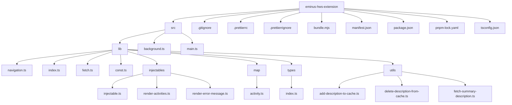

# ¿Cómo contribuir?

## Set up del código fuente

1. Realizar un fork del repositorio
2. Clonar el repositorio

```terminal
git clone https://github.com/<TU-USUARIO>/eminus-hws-extension.git && cd eminus-hws-extension
```

3. Crea una rama con la siguiente nomenclatura

```terminal
git checkout -b fix-issue-<Numero-del-issue>
```

## Instalar extensión

1. Clona este repositorio o descarga los archivos
2. Abre Chrome y ve a `chrome://extensions/`
3. Activa el "Modo desarrollador" en la esquina superior derecha
4. Haz clic en "Cargar extensión sin empaquetar" y selecciona la carpeta del proyecto
5. ¡Listo! Empieza a visualizar tus actividades pendientes

## Estructura del proyecto

A continuación se describe la estructura de carpetas y archivos del proyecto

### Raíz del Proyecto

- **`.gitignore`**: Especifica los archivos y directorios que no deben ser incluidos en el control de versiones de Git
- **`.prettierrc`**: Configuración de Prettier, una herramienta que formatea automáticamente el código
- **`.prettierrignore`**: Archivos y directorios que deben ser excluidos de Prettier
- **`bundle.mjs`**: Archivo para compilar typescript a javascript
- **`manifest.json`**: Configuración y metadatos de la extensión
- **`package.json`**: Contiene las dependencias y los scripts del proyecto
- **`pnpm-lock.yaml`**: Archivo de bloqueo de dependencias gestionadas por pnpm
- **`tsconfig.json`**: Configuración de TypeScript

### Carpeta `src`

- **`background.ts`**: Archivo donde se define el código para la ejecución en segundo plano de la extensión
- **`main.ts`**: Archivo donde se inicia el flujo de la extensión
- **`lib/`**: Carpeta que contiene módulos de soporte para diversas funcionalidades del proyecto
  - **`navigation.ts`**: Código relacionado con la navegación de la plataforma eminus
  - **`index.ts`**: Archivo que exporta el inyectable para la plataforma eminus
  - **`fetch.ts`**: Módulo que maneja las peticiones HTTP
  - **`const.ts`**: Definición de constantes utilizadas en todo el proyecto

### Subcarpetas dentro de `lib/`

- **`injectables/`**: Módulos que manejan la inyección de componentes dentro de la plataforma eminus
  - **`injectable.ts`**: Definición de los componentes que pueden ser inyectados
  - **`render-activities.ts`**: Módulo que renderiza actividades en la interfaz
  - **`render-error-message.ts`**: Módulo que renderiza los mensajes de error
- **`map/`**: Módulos relacionados con el mapeo de actividades u objetos dentro de la extensión

  - **`activity.ts`**: Se limpian los datos que retorna la plataforma eminus acerca de las actividades

- **`types/`**: Definiciones de tipos TypeScript utilizados en el proyecto

  - **`index.ts`**: Archivo de inicialización de tipos

- **`utils/`**: Funciones y utilidades generales del proyecto
  - **`add-description-to-cache.ts`**: Función que agrega descripciones al caché
  - **`delete-description-from-cache.ts`**: Función que elimina descripciones del caché
  - **`fetch-summary-description.ts`**: Función que realiza una petición HTTP para obtener una descripción resumida



## Agregar los cambios

- `git status`: Muestra los archivos modificados
- `git add -A`: Agrega los cambios al area de preparado
- `git commit -m "fix`: <Explica los cambios>"
- `git push fix-issue-<Numero-del-issue>`: Sube los cambios al repo

Despues de agregar los cambios, dirigete al forked repo y ve a la seccion pull request. Te saldra un pop up que dice Pull request. Aprieta el pop up y seras redireccionado a la pagina del pull request.

Llena el formulario y da la descripcion necesaria

Finalmente aprieta en Submit y listo, se hara la contribucion 🎉

> Nota: cualquier duda me puedes contactar al correo rafabeltrans17@gmail.com
